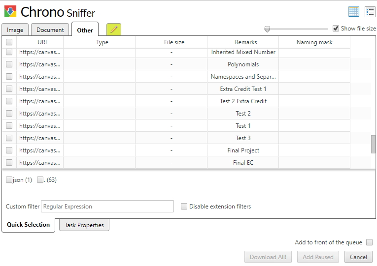

# Convert Canvas Course Assignments into a Pretty HTML file
Have any of your friends asked for the course material of a class you've taken? And you're like, "Ah, sorry, I can't help you. Pretty sure the Canvas output feature is disabled for students like us."

Well now you have a solution! Just follow the following steps, and use the script in this repository! 

## 0. Create a diretory
First, create an emtpy directory: 

`>>> mkdir assignments`

Then create a sub directory in this folder named `files`:

`>>> mkdir assignments/files`

## 1. Download all the assignment files
Download all the assignment pages in html format and move into the `assignments/files` directory. 

An easy way to do this is to use a browser extension. E.g. [Chrono Download Manager](https://chrome.google.com/webstore/detail/chrono-download-manager/mciiogijehkdemklbdcbfkefimifhecn). In Sniffer->Other, choose all the assignment pages needed and hit `Download All!`. 



## 2. Check prerequisites
Make sure you have python and beautifulsoup4 installed. If not, download [Anaconda](https://www.anaconda.com/distribution/#download-section). 

Check: 

```
>>> python -V
Python 3.7.3
>>> pip install beautifulsoup4
Requirement already satisfied: beautifulsoup4 in c:\programdata\anaconda3\lib\site-packages (4.7.1)
```

## 3. Run the script
Open a terminal in the current directory and run the python script. 
```
>>> python scrap.py
7890217.html is processed
...
done!
```
`outputs.html` contains all the assignment descriptions. 

### Todo
- Make a chrome extension to generate the html file at the assignment page with one-click. 
